<div align="center">

# LAPORAN PRAKTIKUM
## MATA KULIAH PARADIGMA SISTEM UNTUK IT
### “ARSITEKTUR MONOLITH VS MICROSERVICES DENGAN FLASK PYTHON”

**Ditulis Oleh :**

Nama : Fajri Ayu  
NIM : 2024903430026  
Kelas : TRKJ 3C

### TEKNOLOGI REKAYASA KOMPUTER JARINGAN
### JURUSAN TEKNOLOGI INFORMASI DAN KOMPUTER
### POLITEKNIK NEGERI LHOKSEUMAWE
### 2026

</div>

---

# Lembar Pengesahan

| Keterangan | Isi |
|---|---|
| No. Praktikum | 01/TIK/TRKJ-3C/Paradigma Sistem untuk IT |
| Judul | Arsitektur Monolith vs Microservices dengan Flask Python |
| Nama | Fajri Ayu |
| NIM | 2024903430026 |
| Kelas | TRKJ 3C |
| Jurusan | Teknologi Informasi dan Komputer |
| Program Studi | Teknologi Rekayasa Komputer Jaringan |
| Tanggal Praktikum | 28 September 2026 |
| Tanggal Penyerahan | 29 September 2026 |
| Dosen Pengampu | Muhammad Reza Zulman, S.ST., M.Sc. |
| NIP | 199205012022031005 |

**Mengetahui,**  
Dosen Pengampu

Muhammad Reza Zulman, S.ST., M.Sc.

**Mahasiswa**  
Fajri Ayu  
NIM. 2024903430026

---

# Daftar Isi

- [Lembar Pengesahan](#lembar-pengesahan)
- [Daftar Isi](#daftar-isi)
- [Tujuan Praktikum](#tujuan-praktikum)
- [Dasar Teori](#dasar-teori)
- [Alat dan Bahan](#alat-dan-bahan)
- [Langkah Kerja](#langkah-kerja)
- [Hasil dan Pembahasan](#hasil-dan-pembahasan)
- [Kesimpulan](#kesimpulan)
- [Referensi](#referensi)

---

# Tujuan Praktikum

Tujuan yang ingin dicapai melalui praktikum ini adalah sebagai berikut.

1. Memahami perbedaan konsep arsitektur Monolith dan Microservices.
2. Membangun backend sederhana menggunakan Flask Python.
3. Membuat dan menguji endpoint HTTP dari terminal menggunakan curl.
4. Memahami cara Order Service mengambil data buku dari Book Service melalui HTTP.
5. Mengamati dan menganalisis perilaku sistem ketika salah satu layanan dihentikan.

---

# Dasar Teori

## 2.1 Arsitektur Monolith

Pada arsitektur Monolith, semua fitur menyatu dalam satu kesatuan: satu kode, satu proses, dan satu port. Dalam praktikum ini fitur buku dan fitur pesanan berada di file `monolith_app.py`. Karena memakai variabel yang sama di memori, fitur pesanan dapat langsung memeriksa dan mengubah stok buku tanpa perantara jaringan.

Kesederhanaan ini membuat Monolith cocok untuk aplikasi berskala kecil. Konsekuensinya, fitur-fitur saling terikat sehingga gangguan pada proses aplikasi dapat berdampak ke seluruh fitur di dalamnya.

## 2.2 Arsitektur Microservices

Arsitektur Microservices membagi aplikasi menjadi layanan-layanan kecil, masing-masing dengan tanggung jawab tertentu dan dapat berjalan sendiri. Dalam praktikum ini terdapat dua layanan: Book Service yang menyediakan data buku dan Order Service yang menangani pesanan. Keduanya berjalan pada port berbeda.

Karena terpisah, Order Service tidak dapat membaca variabel milik Book Service. Data buku harus diminta melalui permintaan HTTP. Keuntungan pemisahan ini adalah gangguan pada satu layanan tidak otomatis menghentikan layanan lain, sedangkan kekurangannya adalah jumlah bagian yang harus dijalankan dan dihubungkan menjadi lebih banyak.

## 2.3 Flask dan Requests

Flask adalah micro framework web untuk Python yang memungkinkan pembuatan aplikasi web dan API dengan kode yang ringkas. Bagian Flask yang dipakai dalam praktikum ini adalah sebagai berikut.

- `Flask(__name__)` untuk membuat objek aplikasi.
- `@app.route(...)` untuk menghubungkan alamat URL dan metode HTTP dengan sebuah fungsi.
- `request.get_json()` untuk membaca data JSON yang dikirim pengguna.
- `jsonify(...)` untuk mengirim jawaban dalam format JSON.
- `app.run(port=..., debug=True)` untuk menjalankan aplikasi pada port tertentu dengan mode debug.

Library Requests dipakai oleh Order Service untuk mengirim permintaan HTTP ke Book Service.

## 2.4 HTTP dan REST API

REST (Representational State Transfer) adalah gaya perancangan layanan yang memakai URL dan metode HTTP untuk mengakses sumber data. Pada praktikum ini data dipertukarkan dalam format JSON dengan dua metode, yaitu GET untuk mengambil data dan POST untuk membuat data baru.

| Endpoint | Metode | Keterangan |
|---|---|---|
| `/books` | GET | Menampilkan daftar buku (Monolith dan Book Service) |
| `/orders` | POST | Membuat pesanan (Monolith dan Order Service) |

Hasil permintaan dinyatakan dengan kode status HTTP. Kode yang muncul dalam praktikum ini adalah 201 (data berhasil dibuat), 400 (permintaan tidak dapat dipenuhi), dan 503 (layanan tidak tersedia).

## 2.5 Komunikasi Antar-Layanan

Pada Monolith, fitur berkomunikasi lewat variabel dalam satu proses. Pada Microservices, komunikasi terjadi lewat jaringan. Dalam praktikum ini Order Service mengirim permintaan GET ke alamat `http://localhost:5001/books` untuk memperoleh data buku, lalu memeriksa sendiri apakah buku yang dipesan tersedia.

Komunikasi lewat jaringan membawa risiko: layanan yang dipanggil bisa saja sedang tidak berjalan. Karena itu pemanggilan dibungkus dengan `try` dan `except requests.exceptions.ConnectionError` agar kegagalan koneksi menghasilkan pesan kesalahan yang jelas, bukan kegagalan yang tidak terkendali.

## 2.6 Fault Isolation

Fault isolation adalah kemampuan sistem untuk membatasi dampak kegagalan pada satu bagian supaya tidak menjalar ke bagian lain. Dalam praktikum ini kemampuan tersebut diuji dengan menghentikan Book Service lalu mengirim permintaan pesanan ke Order Service yang masih berjalan.

---

# Alat dan Bahan

## 3.1 Perangkat Keras

Perangkat keras yang digunakan adalah satu unit laptop dengan sistem operasi Windows yang dipakai untuk menjalankan Python, terminal, dan aplikasi Flask.

## 3.2 Perangkat Lunak

| Komponen | Keterangan |
|---|---|
| Sistem operasi | Windows |
| Bahasa pemrograman | Python 3.14.3 |
| Framework | Flask 3.1.3 |
| Library HTTP client | Requests 2.34.2 |
| Alat uji HTTP | curl.exe |
| Editor kode | Visual Studio Code |
| Terminal | PowerShell (terminal terintegrasi VS Code) |

## 3.3 Struktur Project

Project praktikum berada dalam satu folder bernama “Monolith & Microservices” yang berisi tiga file program.

```text
Monolith & Microservices/
│
├── monolith_app.py
├── book_service.py
└── order_service.py
```

| File | Fungsi | Port |
|---|---|---:|
| `monolith_app.py` | Aplikasi Monolith (fitur buku dan pesanan dalam satu aplikasi) | 5000 |
| `book_service.py` | Book Service pada arsitektur Microservices | 5001 |
| `order_service.py` | Order Service pada arsitektur Microservices | 5002 |

## 3.4 Repository GitHub

Seluruh kode program praktikum disimpan pada repository GitHub berikut agar mudah diakses dan diperiksa.

[https://github.com/fajriayu/Monolith-Microservices](https://github.com/fajriayu/Monolith-Microservices)

---

# Langkah Kerja

## 4.1 Persiapan Lingkungan

Praktikum dikerjakan di Windows menggunakan terminal PowerShell pada VS Code. Langkah pertama adalah memastikan Python sudah terpasang dengan memeriksa versinya.

```bash
python --version
```

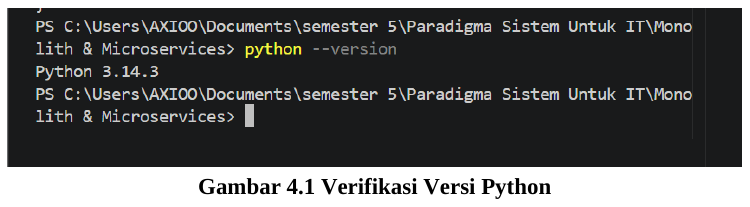

**Gambar 4.1 Verifikasi Versi Python**

Gambar 4.1 menunjukkan Python versi 3.14.3 sudah tersedia. Selanjutnya library yang dibutuhkan dipasang dengan pip.

```bash
python -m pip install Flask requests
```

Setelah pemasangan, versi kedua library diperiksa dengan perintah berikut.

```bash
python -m pip show Flask
python -m pip show requests
```

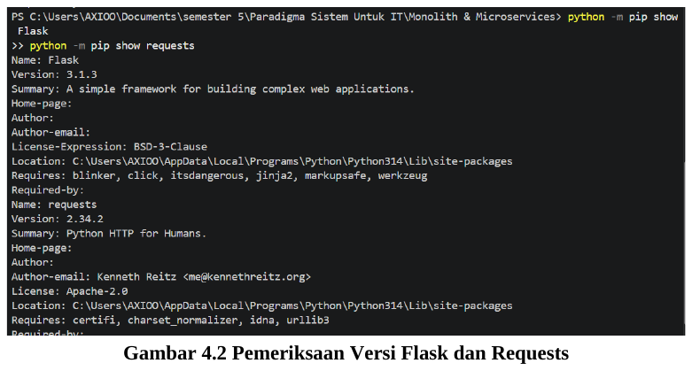

**Gambar 4.2 Pemeriksaan Versi Flask dan Requests**

Gambar 4.2 menunjukkan Flask versi 3.1.3 dan Requests versi 2.34.2 telah terpasang pada folder `site-packages` Python. Terlihat pula bahwa Flask membawa beberapa pustaka pendukung, antara lain Werkzeug, Jinja2, Click, dan ItsDangerous.

## 4.2 Implementasi Monolith

Aplikasi Monolith ditulis dalam satu file bernama `monolith_app.py`. Di dalamnya terdapat data, fitur buku, dan fitur pesanan. Bagian-bagian utamanya adalah sebagai berikut.

- Variabel `books` berisi satu buku (id 1, judul “Belajar Flask”, stok 5) dan variabel `orders` berupa daftar kosong. Keduanya disimpan di memori.
- Fungsi `get_books()` melayani GET `/books` dengan mengembalikan isi `books` dalam bentuk JSON.
- Fungsi `create_order()` melayani POST `/orders`. Fungsi ini membaca `book_id` dari JSON, lalu memeriksa variabel `books` secara langsung. Bila buku ditemukan dan stoknya lebih dari 0, stok dikurangi 1, pesanan dicatat dengan status “berhasil”, dan respons dikirim dengan kode 201. Bila tidak, dikirim pesan kesalahan dengan kode 400.
- Aplikasi dijalankan pada port 5000 dengan mode debug aktif.

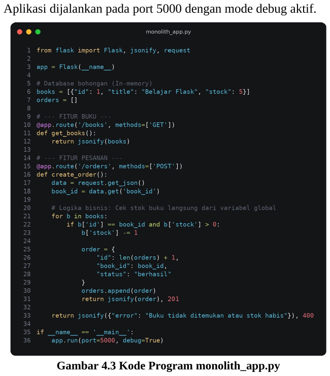

**Gambar 4.3 Kode Program monolith_app.py**

## 4.3 Menjalankan Monolith

Monolith dijalankan dari terminal dengan perintah berikut.

```bash
python monolith_app.py
```

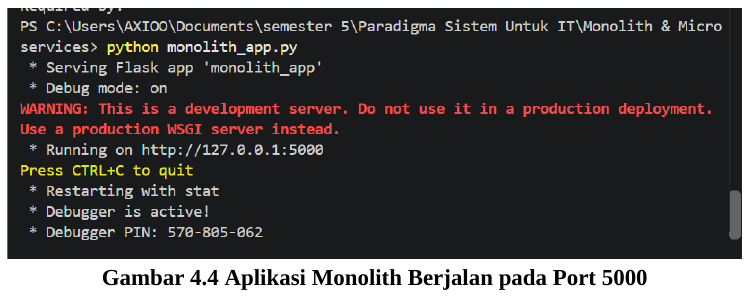

**Gambar 4.4 Aplikasi Monolith Berjalan pada Port 5000**

Gambar 4.4 menunjukkan Flask berhasil menjalankan aplikasi `monolith_app` dengan mode debug aktif pada alamat `http://127.0.0.1:5000`. Tulisan merah merupakan peringatan bawaan Flask bahwa server ini adalah development server yang tidak ditujukan untuk lingkungan produksi, sehingga wajar muncul pada praktikum.

## 4.4 Pengujian GET /books pada Monolith

Pengujian dilakukan dari terminal baru. Pada PowerShell digunakan `curl.exe`, bukan `curl`, karena pada Windows PowerShell versi bawaan nama `curl` merujuk ke alias `Invoke-WebRequest`.

```bash
curl.exe http://localhost:5000/books
```

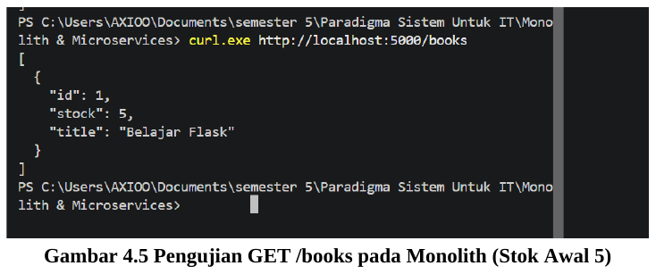

**Gambar 4.5 Pengujian GET /books pada Monolith (Stok Awal 5)**

Gambar 4.5 menunjukkan data satu buku dengan id 1, stock 5, dan title “Belajar Flask”. Hasil ini sama dengan data awal pada variabel `books`, sehingga endpoint GET `/books` berfungsi dengan baik.

## 4.5 Pengujian POST /orders pada Monolith

Pesanan untuk buku dengan id 1 dikirim menggunakan perintah berikut. Pada PowerShell, tanda kutip ganda di dalam JSON harus diberi garis miring terbalik agar terbaca benar oleh `curl.exe`.

```bash
curl.exe -X POST -H "Content-Type: application/json" -d '{\"book_id\":1}' http://localhost:5000/orders
```

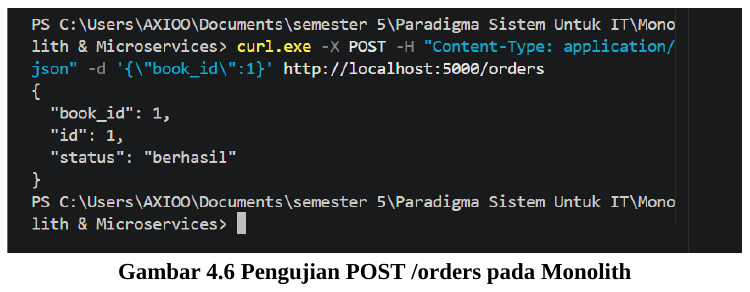

**Gambar 4.6 Pengujian POST /orders pada Monolith**

Gambar 4.6 menunjukkan pesanan berhasil dibuat dengan `book_id 1`, `id 1`, dan status “berhasil”. Pesanan ini diterima karena buku ditemukan dan stoknya masih tersedia.

## 4.6 Verifikasi Perubahan Stok pada Monolith

Untuk melihat dampak pesanan terhadap data buku, endpoint GET `/books` dipanggil kembali setelah pesanan berhasil dibuat.

```bash
curl.exe http://localhost:5000/books
```

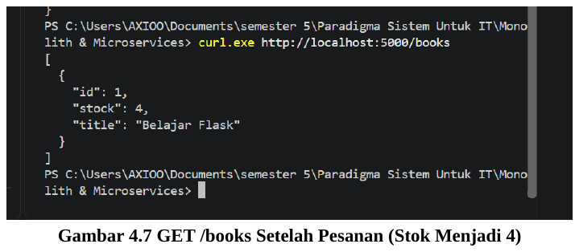

**Gambar 4.7 GET /books Setelah Pesanan (Stok Menjadi 4)**

Gambar 4.7 menunjukkan nilai `stock` berubah dari 5 menjadi 4. Perubahan ini membuktikan bahwa pada Monolith proses pesanan memengaruhi data buku secara langsung karena keduanya memakai variabel yang sama dalam satu proses.

## 4.7 Implementasi Book Service

Pada versi Microservices, fitur buku dipisahkan menjadi Book Service di file `book_service.py`. Book Service memiliki data `books` sendiri dan menyediakan satu endpoint, yaitu GET `/books`, yang berjalan pada port 5001.

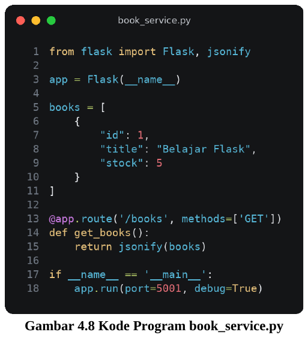

**Gambar 4.8 Kode Program book_service.py**

## 4.8 Menjalankan Book Service

Book Service dijalankan pada terminal pertama.

```bash
python book_service.py
```

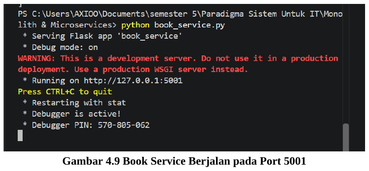

**Gambar 4.9 Book Service Berjalan pada Port 5001**

Gambar 4.9 menunjukkan aplikasi `book_service` berjalan dengan mode debug aktif pada alamat `http://127.0.0.1:5001`.

## 4.9 Implementasi Order Service

Fitur pesanan dipisahkan menjadi Order Service di file `order_service.py`. Order Service tidak memiliki data buku sehingga tidak dapat membaca variabel `books` secara langsung. Cara kerjanya adalah sebagai berikut.

- Alamat Book Service disimpan pada variabel `BOOK_SERVICE_URL = "http://localhost:5001"`.
- Pada POST `/orders`, Order Service mengirim permintaan GET ke `{BOOK_SERVICE_URL}/books` memakai `requests.get()` untuk memperoleh daftar buku.
- Daftar buku tersebut dicari satu per satu. Bila ada buku dengan id yang dipesan dan stoknya lebih dari 0, pesanan dibuat dengan status “berhasil” dan respons dikirim dengan kode 201. Bila tidak, dikirim pesan “Buku tidak ditemukan atau stok habis” dengan kode 400.
- Bila Book Service tidak dapat dihubungi (`requests.exceptions.ConnectionError`), dikirim pesan “Book Service tidak tersedia” dengan kode 503.
- Order Service dijalankan pada port 5002.

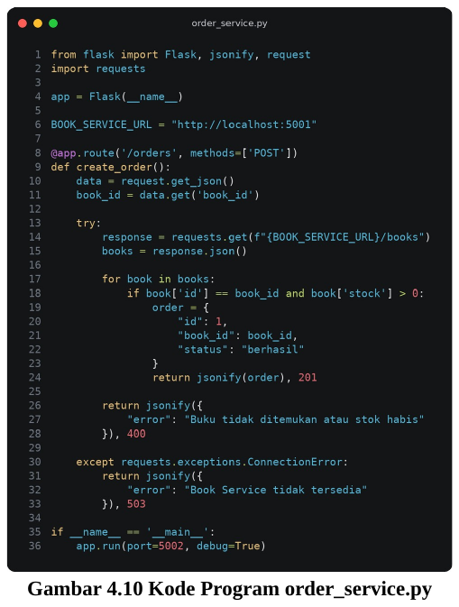

**Gambar 4.10 Kode Program order_service.py**

## 4.10 Menjalankan Order Service

Order Service dijalankan pada terminal kedua, terpisah dari Book Service.

```bash
python order_service.py
```

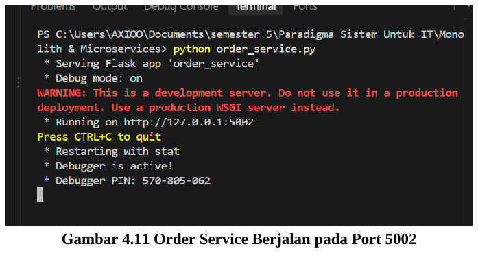

**Gambar 4.11 Order Service Berjalan pada Port 5002**

Gambar 4.11 menunjukkan aplikasi `order_service` berjalan pada alamat `http://127.0.0.1:5002`, terpisah dari Book Service.

## 4.11 Pengujian Order Service

Dengan kedua layanan berjalan, permintaan pesanan dikirim ke port 5002 dari terminal ketiga.

```bash
curl.exe -X POST -H "Content-Type: application/json" -d '{\"book_id\":1}' http://localhost:5002/orders
```

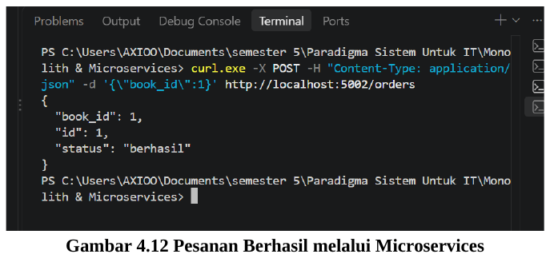

**Gambar 4.12 Pesanan Berhasil melalui Microservices**

Gambar 4.12 menunjukkan respons dengan `book_id 1`, `id 1`, dan status “berhasil”. Order Service tidak membaca data buku sendiri, melainkan meminta data tersebut ke Book Service. Karena Book Service menjawab bahwa buku dengan id 1 tersedia dengan stok lebih dari 0, pesanan dapat dibuat.

## 4.12 Pengujian Fault Isolation

Pengujian fault isolation dilakukan dengan langkah berikut.

1. Book Service dihentikan dengan menekan `Ctrl+C` pada terminal pertama.
2. Order Service pada terminal kedua dibiarkan tetap berjalan.
3. Permintaan pesanan yang sama dengan pengujian sebelumnya dikirim kembali ke Order Service.

```bash
curl.exe -X POST -H "Content-Type: application/json" -d '{\"book_id\":1}' http://localhost:5002/orders
```

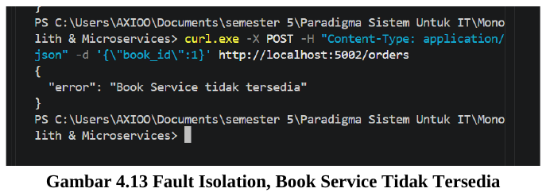

**Gambar 4.13 Fault Isolation, Book Service Tidak Tersedia**

Gambar 4.13 menunjukkan respons `{"error": "Book Service tidak tersedia"}`. Pesan ini dikirim oleh Order Service sehingga membuktikan Order Service masih hidup walaupun Book Service sudah berhenti. Pesan muncul karena permintaan ke Book Service gagal tersambung dan kesalahannya ditangkap oleh blok `except requests.exceptions.ConnectionError`. Sesuai kode program, respons ini dikirim dengan kode status 503.

---

# Hasil dan Pembahasan

## 5.1 Analisis Arsitektur Monolith

Pada Monolith seluruh fungsi berada dalam satu aplikasi yang berjalan pada satu port, yaitu 5000. Endpoint `/books` dan `/orders` hidup dalam proses yang sama, sehingga untuk mencoba kedua fitur cukup satu program yang dijalankan.

Bukti paling jelas dari sifat satu proses ini terlihat pada pengujian stok. Sebelum pesanan dibuat stok bernilai 5 (Gambar 4.5), dan setelah satu pesanan berhasil stok menjadi 4 (Gambar 4.7). Artinya fitur pesanan mengubah data yang sama dengan yang dibaca fitur buku, tanpa komunikasi jaringan. Alur ini sederhana, tetapi membuat kedua fitur saling bergantung pada proses yang sama.

## 5.2 Analisis Arsitektur Microservices

Pada Microservices aplikasi dipecah menjadi Book Service di port 5001 dan Order Service di port 5002. Masing-masing berada pada file sendiri dan dijalankan pada terminal yang berbeda. Book Service menyimpan data `books`, sedangkan Order Service tidak menyimpan data buku sama sekali.

Karena Order Service tidak dapat membaca variabel milik Book Service, ia meminta daftar buku melalui GET `/books`, lalu mencari buku yang dipesan di dalam daftar tersebut. Untuk menjalankan seluruh sistem dibutuhkan dua program yang berjalan bersamaan, ditambah satu terminal lagi untuk pengujian.

## 5.3 Analisis Komunikasi Antar-Layanan

Alur ketika pesanan dibuat melalui Order Service adalah sebagai berikut.

1. Pengguna mengirim POST `/orders` beserta `book_id` ke Order Service (port 5002).
2. Order Service mengirim GET `/books` ke Book Service (port 5001) memakai `requests.get()`.
3. Book Service mengirim daftar buku dalam format JSON.
4. Order Service mencari buku yang dipesan. Bila ditemukan dan stok lebih dari 0, pesanan dibuat dengan kode 201. Bila tidak, dikirim pesan kesalahan dengan kode 400.
5. Bila Book Service tidak dapat dihubungi, Order Service mengirim pesan “Book Service tidak tersedia” dengan kode 503.

Alur ini menunjukkan bahwa Order Service bergantung pada Book Service untuk mengetahui data buku. Ketergantungan tersebut dikelola dengan penanganan `ConnectionError` sehingga kegagalan komunikasi menghasilkan pesan yang jelas.

## 5.4 Analisis Fault Isolation

Ketika Book Service dihentikan dengan `Ctrl+C`, Order Service tetap berjalan dan masih dapat menerima permintaan. Permintaan pesanan tidak membuatnya ikut mati, melainkan dijawab dengan pesan “Book Service tidak tersedia”. Hal ini terjadi karena kedua layanan adalah proses terpisah pada port yang berbeda, dan Order Service menangani kegagalan koneksi dengan `try` dan `except`.

Perlu dicatat bahwa fault isolation tidak berarti semua fitur tetap berfungsi normal. Selama Book Service mati, pesanan tidak dapat diproses. Yang terjaga adalah Order Service tetap hidup dan memberi respons yang terkendali.

## 5.5 Ringkasan Hasil Pengujian

| No | Pengujian | Kondisi | Hasil | Gambar |
|---:|---|---|---|---:|
| 1 | GET `/books` | Monolith | Stok awal `stock = 5` | 4.5 |
| 2 | POST `/orders` | Monolith | Buku tersedia, `status = berhasil` | 4.6 |
| 3 | GET `/books` | Monolith setelah pesanan | `stock = 4` | 4.7 |
| 4 | POST `/orders` | Microservices, Book Service aktif | `status = berhasil` | 4.12 |
| 5 | POST `/orders` | Microservices, Book Service dihentikan | Pesan “Book Service tidak tersedia” | 4.13 |

## 5.6 Perbandingan Monolith dan Microservices

| Aspek | Monolith | Microservices |
|---|---|---|
| Jumlah file program | 1 file (`monolith_app.py`) | 2 file (`book_service.py` dan `order_service.py`) |
| Port | 5000 | Book Service 5001, Order Service 5002 |
| Penyimpanan data | `books` dan `orders` dalam satu program | `books` hanya di Book Service; Order Service tidak menyimpan data buku |
| Akses pesanan ke data buku | Membaca variabel `books` secara langsung | Mengirim HTTP GET ke Book Service |
| Stok setelah pesanan | Berkurang dari 5 menjadi 4 (teramati) | Tidak ada perintah pengurang stok pada kode Order Service |
| Cara menjalankan | Satu perintah pada satu terminal | Dua perintah pada dua terminal, ditambah terminal uji |
| Saat satu bagian berhenti | Semua fitur berada dalam satu proses (konsep, tidak diuji) | Order Service tetap hidup dan memberi pesan error (diuji) |
| Kompleksitas | Lebih sederhana | Lebih kompleks karena ada komunikasi jaringan |

## 5.7 Catatan dan Keterbatasan

Beberapa hal pada kode praktikum perlu dicatat agar hasilnya dibaca dengan tepat.

- Pada Microservices, stok di Book Service tidak berkurang karena Order Service hanya memeriksa stok, tidak memintanya dikurangi. Pengurangan stok memerlukan komunikasi tambahan antar-layanan.
- Nomor pesanan pada Order Service ditulis tetap bernilai 1 dan pesanan tidak disimpan dalam daftar, sehingga pesanan kedua akan tetap bernomor 1.
- `requests.get()` pada Order Service belum diberi batas waktu (timeout).
- Order Service mengambil seluruh daftar buku. Untuk data yang banyak, mengambil satu buku berdasarkan id akan lebih efisien.
- Praktikum tidak mengukur waktu respons, sehingga perbedaan kecepatan antara kedua arsitektur tidak diuji secara langsung.

## Jawaban Pertanyaan Diskusi

### Pertanyaan 1

**Di kode Monolith, jika fitur Pesanan mengalami crash atau bug fatal, apa yang terjadi pada fitur Buku? Bandingkan dengan versi Microservices.**

**Jawaban:** Pada Monolith, fitur Buku dan fitur Pesanan hidup dalam satu proses. Bila bug pada fitur Pesanan cukup fatal sampai menghentikan proses, atau membuat aplikasi gagal dijalankan, fitur Buku ikut tidak dapat diakses karena keduanya berbagi proses yang sama. Sebagai catatan, kesalahan biasa pada satu permintaan di Flask umumnya hanya menghasilkan respons error 500 untuk permintaan itu saja; dampak menyeluruh terjadi ketika prosesnya yang berhenti.

Pada Microservices, fitur Pesanan berada di Order Service (port 5002) yang terpisah dari Book Service (port 5001). Bila Order Service crash, Book Service tetap berjalan sehingga daftar buku masih dapat diakses. Pada praktikum, arah yang diuji adalah sebaliknya, yaitu Book Service dihentikan dan Order Service tetap hidup (Gambar 4.13). Prinsip pemisahan prosesnya sama, sehingga jawaban ini didasarkan pada hasil tersebut.

### Pertanyaan 2

**Pada versi Microservices, pengecekan stok menjadi sedikit lebih lambat karena membutuhkan HTTP Request. Apakah ada solusi untuk mengatasi latensi jaringan ini di industri nyata?**

**Jawaban:** Ada. Latensi memang konsekuensi komunikasi lewat jaringan, dan beberapa cara yang lazim dipakai adalah sebagai berikut. Cara-cara ini dijelaskan secara konsep dan tidak diterapkan pada praktikum.

- **Caching.** Hasil pengecekan yang sering diminta disimpan sementara sehingga tidak perlu menghubungi Book Service setiap kali. Kekurangannya, data tersimpan bisa tidak lagi mutakhir.
- **Komunikasi asinkron.** Untuk proses yang tidak harus dijawab seketika, layanan dapat bertukar pesan lewat antrean sehingga pemanggil tidak menunggu.
- **Timeout dan circuit breaker.** Pemanggil dibatasi waktu tunggunya, dan panggilan ke layanan yang terus gagal dihentikan sementara agar tidak menahan seluruh sistem.
- **Connection pooling.** Koneksi HTTP dipakai ulang agar biaya membuat koneksi baru berkurang.
- **Permintaan yang lebih efisien.** Mengambil hanya data yang dibutuhkan, misalnya satu buku berdasarkan id, bukan seluruh daftar buku seperti pada kode praktikum.

### Pertanyaan 3

**Jika saat peluncuran toko buku ini traffic pencarian buku melonjak drastis sedangkan traffic pesanan biasa saja, layanan mana (dan port mana) yang akan di-scale-up atau diperbanyak servernya?**

**Jawaban:** Layanan yang perlu di-scale-up adalah Book Service pada port 5001, karena fitur menampilkan dan mencari buku berada di layanan itu. Order Service (port 5002) tidak perlu diperbanyak selama traffic pesanan normal.

Inilah keuntungan Microservices: hanya layanan yang bebannya naik yang ditambah kapasitasnya, misalnya dengan menjalankan beberapa instance Book Service di belakang sebuah load balancer. Pada Monolith, karena fitur buku dan pesanan menyatu, menambah kapasitas berarti menggandakan seluruh aplikasi.

Pada praktikum ini Book Service hanya dijalankan satu instance; bila diperbanyak, tiap instance harus memakai port atau server berbeda dan permintaan perlu dibagi di antara mereka.

---

# Kesimpulan

## 7.1 Kesimpulan

Berdasarkan praktikum yang telah dilakukan, dapat disimpulkan hal-hal berikut.

1. Praktikum ini mempelajari konsep arsitektur Monolith dan Microservices serta pembuatan backend sederhana dengan Flask Python menggunakan data in-memory.
2. Pada Monolith, fitur buku dan fitur pesanan berada dalam satu aplikasi (`monolith_app.py`) di port 5000. Endpoint GET `/books` dan POST `/orders` berhasil diuji, dan stok buku berubah dari 5 menjadi 4 setelah satu pesanan berhasil, yang menunjukkan kedua fitur berbagi data dalam satu proses.
3. Pada Microservices, aplikasi dipecah menjadi Book Service (port 5001) dan Order Service (port 5002). Keduanya berhasil dijalankan dan diuji, dan pesanan berhasil dibuat melalui Order Service.
4. Order Service berkomunikasi dengan Book Service melalui HTTP untuk memperoleh data buku, karena tidak dapat membaca variabel `books` secara langsung.
5. Pada pengujian fault isolation, Book Service dihentikan dan Order Service tetap berjalan serta memberi pesan “Book Service tidak tersedia”. Kegagalan satu layanan tidak mematikan layanan lain, walaupun pesanan tetap tidak dapat diproses selama Book Service mati.
6. Monolith lebih sederhana (satu file, satu port, satu perintah, tanpa komunikasi jaringan), sedangkan Microservices membutuhkan lebih banyak file, port, dan terminal serta komunikasi HTTP, tetapi antar-layanan lebih terpisah. Pemilihan arsitektur bergantung pada kebutuhan aplikasi.

## 7.2 Saran

Untuk pengembangan lebih lanjut, kode dapat disempurnakan dengan database sungguhan, validasi input yang lebih lengkap, pengurangan stok pada Microservices melalui komunikasi antar-layanan, nomor pesanan yang bertambah otomatis, serta timeout dan penanganan kegagalan yang lebih baik pada Order Service. Untuk lingkungan produksi, aplikasi sebaiknya dijalankan dengan server WSGI, bukan development server bawaan Flask.

---

# Referensi

1. curl. (t.t.). *curl documentation*. https://curl.se/docs/
2. Fielding, R. T. (2000). *Architectural styles and the design of network-based software architectures* (Disertasi doktoral). University of California, Irvine.
3. Fowler, M., & Lewis, J. (2014). *Microservices: A definition of this new architectural term*. https://martinfowler.com/articles/microservices.html
4. Modul Praktikum. (t.t.). *Hands-on: Arsitektur Monolith vs Microservices dengan Flask Python*. Mata Kuliah Paradigma Sistem untuk IT. [Dokumen PDF].
5. Newman, S. (2015). *Building microservices: Designing fine-grained systems*. O’Reilly Media.
6. Pallets. (t.t.). *Flask documentation*. https://flask.palletsprojects.com/
7. Python Software Foundation. (t.t.). *Python 3 documentation*. https://docs.python.org/3/
8. Requests. (t.t.). *Requests: HTTP for Humans*. https://requests.readthedocs.io/

---

<div align="center">

**Repository GitHub:**  
[https://github.com/fajriayu/Monolith-Microservices](https://github.com/fajriayu/Monolith-Microservices)

</div>
